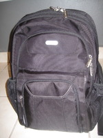
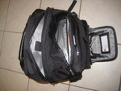
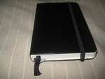
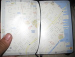
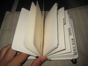
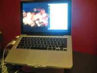
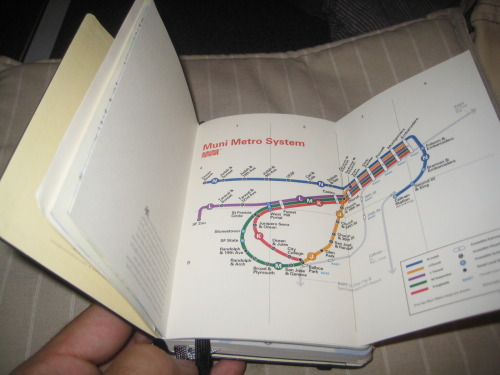

Every year, come summer, Apple hosts the [Worldwide Developer&apos;s Conference](http://developer.apple.com/wwdc/), a full week of [seminars and hands-on labs](http://developer.apple.com/wwdc/sessions/) covering Mac and iPhone development, straight from the Apple engineers themselves. Myself, being a recent Mac convert and a software engineer, couldn&apos;t let this opportunity go by.

As such, *I will be assisting this year&apos;s WWDC*, to be held at [Moscone West](http://www.moscone.com/) in San Francisco June 8 - June 12.

## Preparation

With little over a week left, I am midway through my preparations for what I expect to be a memorable week. I have never visited San Francisco, although it still stands amongst the top three cities I would like to live in (for a short while, at least). It is the heart of the Web 2.0 explosion and home to numerous startups and entrepeneurs like myself.

For all those fellow developers which I am hoping I will get to meet soon, the rest of this post will cover my obsessive compulsive over-preparation for the upcoming trip.

## Finding the Right Laptop Bag

When I got my Macbook, I ordered a homemade sleeve from [Etsy]() as an attempt to give my new machine a unique touch. The sleeve served its purpose and protected the Macbook during its three month stay in a leather briefcase which I hoped would not make me look like a college kid at my workplace. However, it was bulky and stiff and the straps broke loose. So I got myself a Targus checkpoint ready laptop backpack.

Although I would prefer a messenger bag or something with a single strap that would look less like what something a college kid would carry, I had to consider the trip and the need for lots of storage space plus it had to help me get through the TSA with minimal handling of the laptop itself. The bag is the zipper-through kind, which opens up like a clam and leaves the laptop in just one side, with no metal zippers or accessories below it which hopefully will make it clear enough that it is a laptop when seen through the airport X-ray machine.

It has enough pockets to hold my keyboard, mouse, extra power adapter (I have one permanently on my desk, and another in the bag - expensive at $80 a pop, but oh so convenient) and various notebooks and miscellanea which I will get to shortly.

The bag was purchased at CompUSA - yes, the once defunct company. It was purchased by Systemax and seeing that their Caparra, Puerto Rico location was very profitable, they reopened under the same CompUSA branding. It is an excellent store, nothing like the old CompUSA franchise. Prices are way cheaper than Best Buy, and you can order through their site (Systemax owns TigerDirect.com and CircuitCity.com) and pick it up at the store without paying for shipping, even when they have to order it from their mainland warehouse.

## What&apos;s In My Laptop Bag?

As I mentioned already, it holds my Macbook (2009, unibody, 2.4Ghz), the Wireless Apple keyboard and extra charger. I will cover in a future post the whole contents of the bag as the departure date approaches, but I wanted to get to one neat item I found yesterday while shopping at Border&apos;s in [Plaza las Americas](http://www.plazalasamericas.net/).

I bought my first [Moleskine](http://www.moleskine.com/) notebook. But it is no plain notebook - it is actually a [San Francisco city guide](http://www.moleskine.com/moleskinecity/cities/san_francisco.php)! It contains maps of public transportation available in San Francisco ([BART](http://www.bart.gov) and [Muni](http://www.sfmta.com/cms/home/sfmta.php)). I would describe it as the analog version of my iPhone - when my battery is dead or reception is bad, I can still whip out the notebook and look up my schedule, glance at the maps, or simply add to my travel journal.

This is the general area I will be in for the whole week. The Moleskine has these transparent sheets that you can lay over any page, allowing you to mark it up without ruining the map. I&apos;ve marked the Moscone Center and a nearby Apple Store.

As you can see, it also contains a few tabbed pages where I plan to write down all the suggested places I will want to visit or just keep a log of those I&apos;ve visited on my trip. I believe this will make for a very unique keepsake of my first trip to San Francisco.

## Checklist

No more pictures for now - that&apos;s for the later post. Meanwhile, here&apos;s a basic checklist of what I will take with me:

* Macbook
* MagSafe Adapter
* 3 feet of white Ethernet cable - got them for cheap on [monoprice](http://www.monoprice.com)
* [Canon PowerShot SD750](http://www.amazon.com/gp/product/B000NK6J6Q?ie=UTF8&amp;tag=hectorrcom-20&amp;linkCode=as2&amp;camp=1789&amp;creative=9325&amp;creativeASIN=B000NK6J6Q)
* Mini USB cable for the camera
* [Belkin Mini Surge Protector Dual USB Charger](http://www.amazon.com/gp/product/B0015DYMVO?ie=UTF8&amp;tag=hectorrcom-20&amp;linkCode=as2&amp;camp=1789&amp;creative=9325&amp;creativeASIN=B0015DYMVO) (share rare power connectors with buddies)
* [Belkin Swivel Hub](http://www.amazon.com/gp/product/B000TTMEWO?ie=UTF8&amp;tag=hectorrcom-20&amp;linkCode=as2&amp;camp=1789&amp;creative=9325&amp;creativeASIN=B000TTMEWO), swivels for easy access
* [LaCie 8GB iamakey USB Flash Drive](http://www.amazon.com/gp/product/B001V7XPSA?ie=UTF8&amp;tag=hectorrcom-20&amp;linkCode=as2&amp;camp=1789&amp;creative=9325&amp;creativeASIN=B001V7XPSA)
* Mini Flashlight
* Business cards
* Moleskine San Francisco City Guide
* [Moleskine Notebook](http://www.amazon.com/gp/product/B000JKN54E?ie=UTF8&amp;tag=hectorrcom-20&amp;linkCode=as2&amp;camp=1789&amp;creative=9325&amp;creativeASIN=B000JKN54E), for note taking at the seminars
* iPod Video
* Pens and pencil
* Altoids

## Exploring San Francisco

Lonely Planet, makers of popular city exploring guides, has placed their [San Francisco iPhone app on sale](http://appshopper.com/travel/lonely-planet-san-francisco-city-guide) in anticipation of WWDC. The price is great: FREE. This, along with my Moleskine city guide and friend&apos;s recommendations, shall be enough to get me around San Francisco on those rare chances I might get to explore the city.

