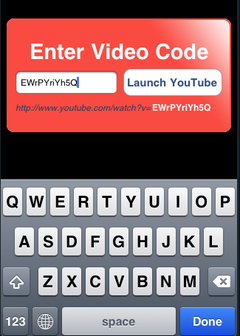

--- 
name: youtool-youtube-video-launcher-for-your
layout: post
title: "YouTool: YouTube Video Launcher for your iPhone"
time: 2009-07-03 23:10:00 -04:00
comments: true
---
Earlier this week, one of my iPhone applications was released for sale in the iTunes App Store. [YouTool](http://www.hectorramos.com/youtool/) is an application that allows the user to launch a YouTube video without having to search for it through the YouTube iPhone App.

Why would you need this? Well, the app actually arose out of my own need. I developed it earlier this year because at my workplace, YouTube is blocked and I would sometimes receive a link to a YouTube video through e-mail or IM, but I wouldn’t be able to open it. I would then proceed to either ask my friend for the name of the video so that I could search for it on the iPhone, or I would e-mail myself the link so that I could open it through the iPhone’s Mail application.

Sometimes, the e-mail would not get there fast enough, and I would proceed to laborously type in the whole URL into Safari which would then enable me to watch the video. That’s when I thought I could make a simple app that asks for the unique YouTube video identifier code and it would take care of forming the whole URL for myself, which I could use to open YouTube.

How does it work? Let’s say you receive the following URL: [http://www.youtube.com/watch?v=EWrPYrIYh5Q](http://www.youtube.com/watch?v=EWrPYrIYh5Q)

Notice that string of characters at the end of the URL? Those identify your video uniquely in YouTube’s system. In this case, EWrPYrIYh5Q is the code for the video you just received. YouTool is an utilty application, so launching it will take you straight to the only screen you will need:

Tap on the text field and input your video code: EWrPYrIYh5Q

Tap Done or the Launch YouTube button to start enjoying your [video](http://www.youtube.com/watch?v=EWrPYrIYh5Q) in the native YouTube iPhone app!

YouTool has been in my iPhone for months, and was one of the first iPhone applications I developed. It took only 30 minutes to program, and some more to come up with the simple graphics. I never intended on releasing it, but as I kept getting queries from my friends regarding the same YouTube scenario, I decided to polish the app and [release it for free on the iTunes App Store.](itms://itunes.apple.com/WebObjects/MZStore.woa/wa/viewSoftware?id=320588383&mt=8&s=143441)

So enjoy!