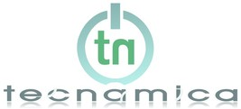

--- 
name: tecnamica-interview-with-vaya-broqui
layout: post
title: Tecnamica Interview with Vaya Broqui
time: 2009-07-05 14:12:00 -04:00
comments: true
---
[Tecnamica](http://www.tecnamica.com/) is a new development in Latin America, covering technology in Spanish. They are distinguishing themselves by creating their own content and producing a weekly podcast covering the hottest news in the tech world. They called us shortly after getting back from WWDC for an interview. It was a very fun afternoon session where we covered everything from the formal WWDC event, to our adventures meeting other developers and the future of [Vaya Broqui](http://www.vayabroqui.com).

The podcast is now available [here](http://tecnamica.com/2009/07/05/podcast-7.aspx).