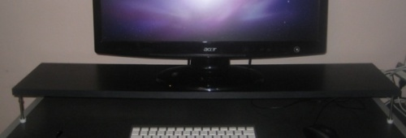

--- 
name: cheapskate-monitor-stand
layout: post
title: A Cheapskate's Monitor Stand
time: 2009-10-21 22:34:00 -04:00
comments: true
---

I’m always looking for ways of improving my workspace. Being a tall guy, I prefer to use the desk surface to place the keyboard and mouse, instead of using a keyboard tray. However, this places the monitor a few inches below eye level. So for a long time, I have been using two or three thick books to prop up the monitor.

Why didn’t I get a monitor stand? Well, most of them are $30 or $40 at least, and they still are no more than 10” wide or so. This is actually annoying, as I can’t push the keyboard or mouse underneath, which is the most comfortable position for me. Then I saw [this post at IKEA Hacker](http://ikeahacker.blogspot.com/2008/12/tv-shelf-with-door-stoppers-for-legs.html) with instructions on how to create a stand using cheap hardware and decided I would do the same.

Ten months later, I finally set out to Home Depot. I knew I needed a roughly 36” by 8” shelf, and around 4” of lift. I found a black shelf with similar dimensions, and got four 3” door stops. All for under $15:

Black Shelf: 8.28  
Doorstop (4@1.71): 6.84  
Total: $13.82

To build this, you’ll need a drill, a 3/32” drillbit (might vary, check your doorstopper’s dimensions), a ruler and a pencil to mark off the locations for the door stops. If you haven’t figured it out by now, the door stops will serve as the legs of this monitor stand. Why? They provide the lift I need, without occupying too much desktop area.

 You can do this by yourself, certainly. However, I had someone help me with the measurements.

For these door stops, which are roughly an inch wide, I measured 0.5” from each edge and marked it off. You might want to try 1”, but don’t over do it or you will end up with an unstable stand. Once you have the spot marked, get your 3/32” bit and drill a guide, a little over halfway in - just make sure it does not go out the other side.

Then you will want to take one of the door stops, and screw it in by hand. Really, if you don’t know how to screw this into the hole, you have a problem.

Actually, you might need a little help to finish screwing it in. Just get some pliers and tighten them up.

 Repeat for all for corners, flip and place on your desk. New monitor stand!

 

It feels pretty good, gives me enough height and I can comfortably push the keyboard and mouse around without hitting anything. I might get a fifth door stop because it is sagging a little in the middle, but so far it seems like it will hold up. That’s it! Soon, I’ll show you how to build your own desk out of a door and some height adjustable legs. First, I need to build it, though.