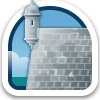
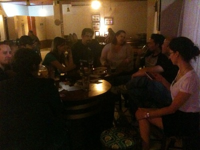
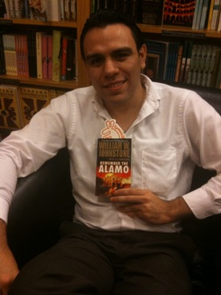

--- 
name: gowalla-hunt
layout: post.html
title: Gowalla Hunt
time: 2009-11-26 20:25:00 -04:00
comments: true
---
If you [follow me on Twitter](http://www.twitter.com/hectorramos) you might have noticed all the check ins I’ve been making through a neat geolocation service called [Gowalla](http://www.gowalla.com). This service allows you to selectively share your current location with your Gowalla (and Twitter and Facebook) friends.

What makes it different from [BrightKite](http://www.brightkite.com) and [Foursquare](http://foursquare.com/) is the great attention to detail and design in the application, from its featured icons all the way to the items you can collect throughout your travels. Also, as opposed to Foursquare, it is available in Puerto Rico and any city worldwide. Not only is the content creation in the hands of the Gowalla team, users can create their own spots. Any Gowalla user can drive up to a venue and register it with the service. The team is open to user feedback, as you may suggest spots that could be promoted to the Featured section. One such example is the [Castillo San Felipe del Morro](http://gowalla.com/spots/109899) in San Juan, Puerto Rico, which was just added this week.

Recently I had the opportunity to meet [Sandi Weldon](http://www.twitter.com/sanlei) from [Alamofire](http://alamofire.com/), the Austin startup behind Gowalla, in an improvised Gowalla meetup with other passionate users. She handed out some neat Gowalla swag that I want to pass on to you. I thought that the best way to do so would be to demonstrate the social geolocation aspect of Gowalla while doing so.

To kick off this game, we’ll start with a cool Gowalla sticker. You want it? Then you should check out my [Gowalla profile](http://gowalla.com/users/hramos), look at the places I’ve been this week and figure out where I could have had hidden the sticker.

Here’s a hint:

Do you think you know where the Gowalla sticker is? I’d like to hear from you - did you find the sticker? Did a Gowalla user beat you to it? (Check the People tab at that spot!) You can find me at [@hectorramos](http://www.twitter.com/hectorramos) (or write to gowalla [at] hectorramos.com). Keep Gowallaing!

Gowalla is [available for the iPhone in the AppStore](http://www.itunes.com/app/Gowalla). You can also use Gowalla on your Android, iPod Touch or webkit geoenabled mobile device of choice through the [mobile website](http://m.gowalla.com).
