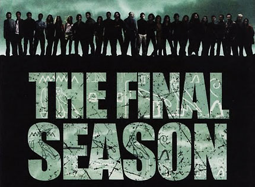

--- 
name: la-x
layout: post
title: LA X
time: 2010-02-03 17:53:00 -04:00
comments: true
categories: tv
---

Yes, this is the mandatory [LOST](http://en.wikipedia.org/wiki/Lost_(TV_series)) post. If you are no fan of the show, or you haven’t watched the Season 6 Premier, then I recommend skipping this post.

 LA X. Title for the Season Six Premiere. Sure, LAX is the airport code for Los Angeles International Airport, but as always, titles have a deeper meaning. What is that meaning? No one knows for sure, but it might be closely related to the divergent timeline that we are observing in this new and final season.

 Carlton and Damon would like you to [believe](http://popwatch.ew.com/2010/02/02/lost-premiere-damon-carlton/) that these are sideflashes - we are seeing what would have happened had the LOSTies not crashed into the Island. Or that we may be experiencing a fork in time, where the cat is [both dead and alive](en.wikipedia.org/wiki/Schrödinger's_cat). But this is LOST. You haven’t forgotten Season 3’s finale, have you? We thought we were seeing Jack’s flashback, which turned out to be a flashforward to 2007\. Season 4 showed us how the Oceanic Six were living after being rescued while simultaneously showing how they ended up being rescued. What if there are no forked timelines? What if… we are seeing the epilogue, the actual ending of the show, right now as the season progresses? Calling it: Jack will get his neck hurt during the Season Six finale.

 There are various differences that might point to that possibility.

*   Hurley is the luckiest man alive. 

*   Rose comforted Jack’s fear after the turbulence. 

*   Charlie is alive, thanks to Jack and possibly thanks to the rehab program he would be taken into now that the authorities have arrested him. 

*   Sawyer is nice and friendly.

*   Shannon is alive and well in Australia.

*   Christian Shephard’s body has disappeared, along with Locke’s knives.

Remember the sunken LOST island? Other than a nod to the Atlantis theme, we see that New Otherton was constructed before the island was sunk. This points to the fact that the Jughead was not that which sunk the island. The island must have sunk sometime after the whole Jacob vs Smoke Monster conflict that is now going on in 2007 on the unsunken island - we will see that happen at the end of this season. Or I could be wrong, and the island simply sunk when it was moved by Ben - unlikely.

Oh, and Desmond. Don’t forget that Desmond has been dislodged from time before - the flashes before his eyes, going to 1996 and back. If the timeline has forked - and remember, there is no alternate timeline as there is no real timeline - then Desmond can flash between both timelines. That is why he is one moment in the plane, and the next he has disappeared. This fits even if the LAX LOSTies are living out the epilogue of the story. Thinking of time as a spiral, with a skipping needle as Faraday described it, Desmond is the needle going from one track to the other in this spinning disc of time.

 Enough time travel. Jacob’s Nemesis is the Smoke Monster. A force of evil that seems to be contained within the island, constrained by rules which keep it from harming Jacob directly. But wait - Jacob’s people live at the Temple, the Temple which’s walls are home to the Smoke Monster? Why weren’t Jacob’s people afraid of the Smoke Monster before?

Well, Ben said these walls are far away from the Temple itself. Still, maybe they were equally protected by the rules, rules which were broken once the Nemesis found a loophole which got Jacob killed. That is why they run and scamper to get the ash around the temple to keep Nemesis out. What about the flare?

Does the Smoke Monster need a body to assume a new identity? We’ve seen Yemi’s body disappear before, along with Christian’s. But Locke’s body is there. Did the bodies get disposed by the Smoke Monster in order to keep up its disguise? Was Locke’s body simply out of reach and that is why he was discovered?

Was Christian the Smoke Monster in disguise? If so, it seems that the Smoke Monster, through its apparent mind reading, can also imprint it’s vessel’s personality. That is why we see traces of Christian and Locke in these manifestations.

Was the ash around Jacob’s cabin actually to keep Nemesis out while Jacob relaxed? But if they can’t hurt each other, why would Jacob need it?

Sayid - is he the new vessel for Jacob, the result of a loophole within a loophole, set in place by Jacob in case of Nemesis finding a way to kill him?

Questions were answered. More questions were created. This is why I love LOST so much.