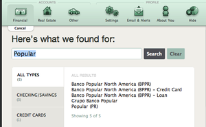
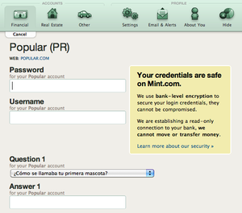

--- 
name: using-mint-as-bppr-customer
layout: post
title: Using Mint as a BPPR customer
time: 2010-03-03 13:32:00 -04:00
comments: true
categories: mint
---
 

For almost two years, we’ve been trying to get [Mint](http://www.mint.com) to work with [Banco Popular de Puerto Rico](http://www.popular.com)’s accounts. It all began with the migration to the current 3rd generation BPPR version.

Some background, first. Mint is a personal finance manager that launched at [TechCrunch40 in 2008](http://www.techcrunch.com/2007/09/18/mint-wins-techcrunch40-50000-award/). It helps you keep track of your transactions, set up budgets and receive alerts on your mobile device. It is an excellent tool for budget management, so much in fact that [Intuit bought it up for $140 million last fall](http://techcrunch.com/2009/09/14/the-value-of-techcrunch50-mint-acquired-by-intuit-for-170m-two-years-after-winning-tc40/).

To work with your transactions, Mint needs access to your online banking website. Mint employs the services of [Yodlee](http://www.yodlee.com) to aggregate all of your accounts. What Yodlee does is abstract the process of scraping your online banking website, providing a single API for Mint and [other customers](http://www.blippy.com). Yodlee has a database of the most popular online banking sites, their URLs, and their login process.

So the problem seems to have appeared when BPPR started using multitiered authentication. A weird occurrence, since Yodlee and PassMark (now RSA, providers of multitier authentication to many banks) have a ‘[strategic alliance](http://www.highbeam.com/doc/1G1-128053528.html)’ which should help them deal with these types of logins. It was not showing all of the security questions available to BPPR customers. It seemed to be in part due to BPPR’s use of both English and Spanish security questions. I won’t go into any more detail - what I am discussing is pretty obvious for the savvy user, but I get a feeling that most executives would not like it if I went into a detailed account of how the authentication system works.

;)

After some back and forth with Mint and later Yodlee, it seems like it is finally working. Please note that I am speaking from my personal point of view, and you should wait for any official statement from BPPR. In the meantime, I will share various tips that might help you link your BPPR account with Mint.

*   When adding your account, please make sure to select “Popular (PR)” as your bank. 

*   You must have had set up your security questions in Spanish. The way BPPR works, it will always ask your question in your initial preferred language. Even though you can switch languages for the website on the fly, this does not apply to the security questions at the moment. I expect this to be changed soon to fully support Mint, but don’t quote me on that. 

*   Why Spanish? Because Yodlee still has an incomplete set of questions available, and it seems like the only valid set of questions that will match in both Mint and BPPR are in Spanish. The questions that worked for me were:

2.  ¿Como se llamaba tu primera mascota?

4.  ¿Cual era el nombre de tu escuela superior?

6.  ¿Cual es el nombre de tu abuelo por parte de padre?

*   Some users report that using the same answer for all security questions helped them. It should still work with different answers to each question, but perhaps this can also help if your questions were set up in English initially. Your mileage may vary.

That’s it. Please discuss which methods worked and which didn’t, as we collect all these tips and get nearer to having Mint available for everybody.

Note: Blippy.com doesn’t work as of this writing, even though I think they use Yodlee, too.