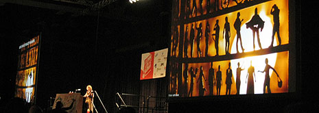
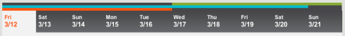
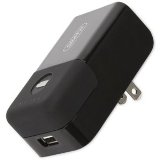

I’ve been back in Puerto Rico for the last two days or so, decompressing from the trip to Austin and getting ready to get back to work. There is so much I want to write about the different panels and events I attended, but even after two days, I haven’t got the notion of where to start.

Let’s start with what, exactly, is “southby” supposed to be. According to [Wikipedia](http://en.wikipedia.org/wiki/South_by_Southwest), **South by Southwest** (**SXSW**) is a set of [interactive](/wiki/Interactive_media "Interactive media"), [film](/wiki/Film "Film"), and [music](/wiki/Music "Music") festivals and conferences that take place every spring in [Austin, Texas](/wiki/Austin,_Texas "Austin, Texas"). SXSW first began in 1987 and is centered on the downtown [Austin Convention Center](/wiki/Austin_Convention_Center "Austin Convention Center"). Each of the three parts runs relatively independently, with different start and end dates.

Here’s a teaser for SXSW2010 from last year (filmed at previous SXSWs):

<object width="640" height="385"><param name="movie" value="http://www.youtube.com/v/YSp1MQaqiSg&amp;color1=0xb1b1b1&amp;color2=0xcfcfcf&amp;hl=en_US&amp;feature=player_embedded&amp;fs=1"><param name="allowFullScreen" value="true"><param name="allowScriptAccess" value="always"><embed src="http://www.youtube.com/v/YSp1MQaqiSg&amp;color1=0xb1b1b1&amp;color2=0xcfcfcf&amp;hl=en_US&amp;feature=player_embedded&amp;fs=1" type="application/x-shockwave-flash" allowfullscreen="true" allowscriptaccess="always" width="425" height="385"></object>

The events I assisted formally are collectively known as SXSW Film+Interactive. The Gold Badge grants its wearer access to all the Film and Interactive tracks, badge events and film screenings throughout Austin. Interactive, by itself, lasted from March 12 to March 16. Film panels were held from March 12 to March 16 as well, but film screenings went on through March 20. The Music festival itself is held from March 17 to March 21.

This is a point that was initially confusing to me when I was arranging travel and lodging. I didn’t want to leave while Film was still going on, but I was told that Music was too crazy. I ended up staying from March 11 to March 19 in Austin, which I believe was a great choice and worked out very well. I was able to go to the Interactive panels, and still had two days to catch up some film screenings I’d missed - all while being able to take in the Music festivities.

The Music festival is another monster by itself - you can get Music badges (or the end-all Platinum which covers F+I as well), but there are also Music wristbands that allow you to get in to the live shows if you are not interested in the Music panels. The wristbands are much cheaper than a badge ($165 versus ~$700) and are the popular choice among attendees. On top of all that, there are SXXpress passes you may get a few hours before each event, which are limited to a percentage of the capacity of the venue and allow you to skip the lines.

Anyway, what should you do next year for SXSW 2011 if it is going to be your first time? I am no SXSW expert, of course, this being just my first time, but there might be some value to you in these guidelines that may already be common sense amongst SXSW veterans and is not touched upon by the community.

## 1. Leave the laptop. Take your iPad.

Unless you are a journalist or blogger with the intention to liveblog the event, there is just no need for a laptop in the panels. Your typing might be distracting, you won’t be able to focus on the discussion, and you will look like a dork walking around town with your backpack. Luckily, Austin is full of geeks like you during Interactive, so you won’t stand out.

However, some nighttime venues don’t allow two-strap bags in, as they can certainly occupy the space of an additional customer. I did take my laptop with me half of the time (you’ll see why soon), but I tried to go back to the hotel or have someone take it back to me sometime between 5 and 7 PM so that I could enjoy the parties at night without extra burden.

This is where I can see the iPad shine. I certainly would feel naked if I travelled without my laptop, but I don’t want to deal with the burden. Many Interactive attendees talked about and concurred that next year we won’t see that many laptops, and instead we will see iPads all around.

## 2. If you have an iPhone, prepare yourself

Get a battery pack - ideally a rechargeable one. Carry two, if possible. This year, Chevy had a recharge lounge, and lots of multiplugs spread throughout the Austin Convention Center, which made it very easy to stop for a few minutes and get juiced back up. However, between so many panels and events, you just can’t afford to waste hours waiting for your devices to charge up.

I never ran out of battery, although quite a few times I dipped under 10%. My method was to carry a [Griffin PowerDuo](http://www.amazon.com/gp/product/B002SOG4NI?ie=UTF8&tag=hectorrcom-20&linkCode=as2&camp=1789&creative=390957&creativeASIN=B002SOG4NI), a backup battery along with its recharging base station - both are small enough to fit in your pants pocket. On the go, the battery pack would keep the iPhone charged up between 95% and 100%. In between panels, I’d recharge the pack as much as I could. Most rooms do have outlets, so the station made it easy to plug it in and go away without being tethered. If you could stay near the outlet, then its even better - the base station has a USB port which allowed me to charge the iPhone while recharging the battery.

Another tool at my disposal was a [Griffin TuneJuice Charger](http://www.amazon.com/gp/product/B001DQNAJ8?ie=UTF8&tag=hectorrcom-20&linkCode=as2&camp=1789&creative=390957&creativeASIN=B001DQNAJ8) which was given out by Groupon at their breakfast event. The charger fits four AA batteries, and while it can’t recharge them, it allows you to throw as many AAs as you can fit into your backpack, or even buy some extra AAs in an emergency, and charge your iPhone with it. The four included AAs helped me get back to 33% only, which is just about as much as the PowerDuo does as well.

Finally, since I had my laptop with me most of the time (going against my own tip #1), I would usually keep the iPhone charged by leeching some energy from the USB ports, either during panels, or even while walking around by routing the USB charge cable through the backpack down to my pocket. Geeky? YES.

The laptop would only go down 10% with each full charge of the iPhone, and as I didn’t use it much, it worked great as a humongous extra battery for the iPhone. That 10% I would get it back quickly by plugging in during panels or in the hallway outlets.

## 3. Tuck in your badge when leaving the Austin Convention Center

Don’t walk around town with your SXSW Badge flapping in the wind. Although there are many things that will still give you away as a tourist, you still don’t want a $700 badge giving you away so quickly. You don’t want locals rolling their eyes and thinking “oh, Southby” whenever you try to venture into town. I would usually tuck it inside my jacket or shirt when leaving the ACC and then getting it out whenever I needed to get back into a badge event. 

## 4. Make your reservations three months before SXSW… or earlier. Or don’t.

I stayed at the Embassy Suites just across Congress Bridge, which was very convenient as it was just a 10 minute walk to the Austin Convention Center. Even then, next year I will try to nab a room closer to the ACC just for convenience.

With that said, the last three days of my stay at Austin were 7 KM away from downtown, in the Comfort Inn at Riverside. I still was able to have a great time, thanks to the R&R shuttles set up for SXSW. Most of the out of town hotels were served by these shuttles, which only cost $40 for a 4/5 day pass. There are two passes: one for Film+Interactive and one for Music. I only needed the latter, because I only went out of town during Music, but if you plan to stay for the whole week out of town you will need to get both passes (totalling $80). The taxi ride would cost you at least $20 each way, so the shuttle is very, very economical.

These shuttles depart every 30 mins or so, which isn’t too shabby. Oh and one more thing, get a hotel with complimentary breakfast.

## 5. Make your schedule

The final dates are not revealed until close to the event, so don’t even think about coming up with a perfect, down to the minute schedule before the event starts. However, do mark on your schedule which events you do not want to miss at all. The rest of your schedule should revolve around these main events. You may mark which events are interesting for you, and most of these will be going on at the same time. There’s nothing you can do about that. But at least knowing which events are of interest beforehand will help you when you are going out of one panel and need to know if you should go down four levels, walk to another hotel or take a shuttle for your next panel.

Ah, keynotes. Be there one hour before the keynote is set to begin, or you will have to go into an overflow room. Might as well stay home watching the livestream in that case.

Film screenings: for all but the headliner (KICK ASS) we were able to get into a screening by being there one hour early. KICK ASS had 3,000 people trying to get into a ~300 seat theater. NO. WAY.

And finally, Diggnation Live. We were able to attend it only thanks to [Addis’s](http://blog.seram.us) efforts in being there three hours early, in line, and still having about 300 people ahead of us.

## 6. Love thy taco trucks

Austin has great street fare, which helps a lot when you need to grab a quick bite without dining in in order to hit that next panel in half an hour. ONE TACO set up shop a block away from the convention center, and they had constantly 20 people in line - they’re that good.

You will find many street vendors near the convention, just walk around and pick whichever looks good for your taste. Leave the restaurant for dinner, or hit a party with free food (and booze, of course).

## 7. Put away your gadgets

SXSW is about the people. Don’t waste your time there looking at Twitter or reading blogs. Use your smartphone to find where people are at with [Gowalla](http://www.gowalla.com), then go there and TALK to people. Don’t be That Guy looking at his phone all the time.

## 8. Venture out of SXSW

There will still be many badge-less events going on around town. Most of the official Interactive parties are not that great, so be on the lookout for unofficial popup events. This year, [Gary Vaynerchuk](http://garyvaynerchuk.com/) threw a secret wine party and only revealed the location 10 minutes before it started. I found out about a Lean startup meetup from someone who wasn’t attending SXSW, and that event was more eye opening than most of the panels.

The last day in Austin, I didn’t go to any film screening. I just walked all over Sixth Street, taking it all in. I had as much fun that day as some of the official SXSW Interactive days.

## 9. Go local

Austin is very resistant to corporate invasion, and as such is full of small businesses. I saw so many diverse, unique and special restaurants and coffeeshops all throughout the city. Only Starbucks was ever present - you don’t see lots of national chains in the downtown area. Try to visit as many of these venues, as each will certainly have some special touch that you wish was present in the corporate chains in your town.

Try the Alamo Drafthouse - these cinemas have great food and beer served during the movie. Go for Torchy’s Tacos, the best in Austin. Have dessert at Halcyon, after a great dinner at Ranch 616. Drinks at La Condessa, The Gingerman or the Dirty Dog - something for everyone.

Finally, visit the Capitol grounds. That’s the obvious one.

## Have fun!

You really don’t have to follow any guidelines. I tried not to overschedule my plans for Austin, and just took it all in as it passed me by. It was an awesome week and look forward to going back in 2011. I hope this little guide helps convince you to join me next year.

And yes, I promise I will eventually blog about the panels I attended; there is so many to write about, I haven’t been able to get to it. 
