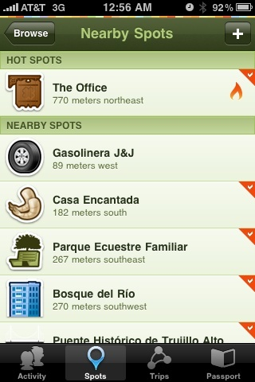
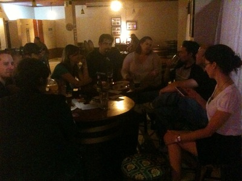
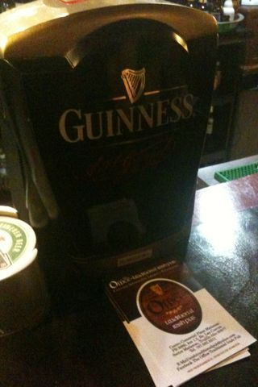

There’s a new Irish pub close to my apartment in Trujillo Alto. It’s called [The Office](http://www.facebook.com/group.php?gid=129744091927), a traditional [irish pub](http://theofficetraditionalirishpub.webs.com/):

The objective of The Office Traditional Irish Pub is to attract professionals, retired people, artists and musicians. We aim to  provide a healthy and educated and pleasant environment for everyone to feel at ease or sit around and talk. To share and relax with your friends. We will be offering an open stage for artists, poets and musicians (acoustic, classic and flamenco).

I found it by chance and quickly fell in love with the place. We’ve been frequenting it for the last couple of months, so much it has become a [staple of our weekends](http://gowalla.com/spots/519257). 

I’m glad that everyone seems to like the place so far. They have a great variety of imported beer, in addition to the usual found in Puerto Rico. If you like beer that is a little off the beaten path, you’ll love this place. Tom and Joe are excellent hosts and they’ll help you feel at home.

Episodes of [En Profundo](http://www.enprofundo.com), a new local podcast that covers a variety of timely topics, are routinely recorded in The Office. Last night, in addition to the usual crew from [Frecuencias Alternas](http://www.frecuenciasalternas.com) and En Profundo, we had the chance to meet up with a great group of friends which we only get to know through online networks.

Among those in attendance last night (starting with those in the picture above):@meebits, @arkhangel, @vanessaenid, @luiscrz, @mj16, @joeprog, @dr_zu, @therealgabo and his brother, @sumares, @eldifusor, @dianadhevi, @veedot, ex-@8008135,  @arsenic447, @popculturerobot, and myself, @hectorramos. It was great to see all of you in the same place and look forward to more casual meetups such as this one in the future.

