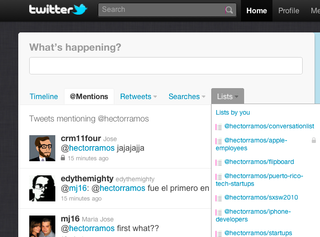

The new [Twitter](http://www.twitter.com) has hatched and is now more realtime than ever. The rapidly growing service is no longer about tweeting, but about discovery. As Ev said earlier today, you don’t have to tweet to use Twitter. Following on this premise, the new Twitter is dynamic and fast.

Images and videos can now be viewed from Twitter.com itself. Up until today, third party websites filled these niches as a way of setting themselves apart. Twitter will not host these files, so there is still a place for some of these services, but media embedding should no longer be a sole primary feature.

To emphasize discovery, the search bar is now featured prominently in the header of the new Twitter website. Selecting a tweet will open a new pane in the side bar which will include extra information such as the user’s timeline. If the tweet contains a link to pictures or videos, it will automatically be embedded in this side bar.

Replying to tweets is now even smoother, with a new popup that lets you tweet without scrolling to the top input form.

Viewing mentions, retweets and lists are also faster now as they will load in the same column without refreshing the website. These dropdown lists make accessing all your lists so much easier.

The new Twitter will be slowly rolling out worldwide. Having only used it for five minutes, it looks very sleek but I will need some more time to go through all of the new features. Look for an update later.
